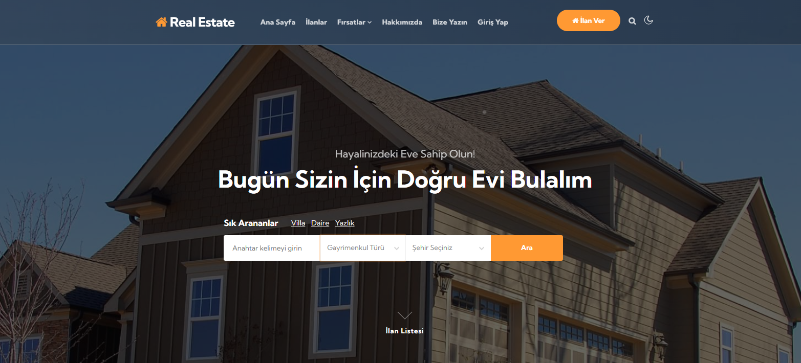
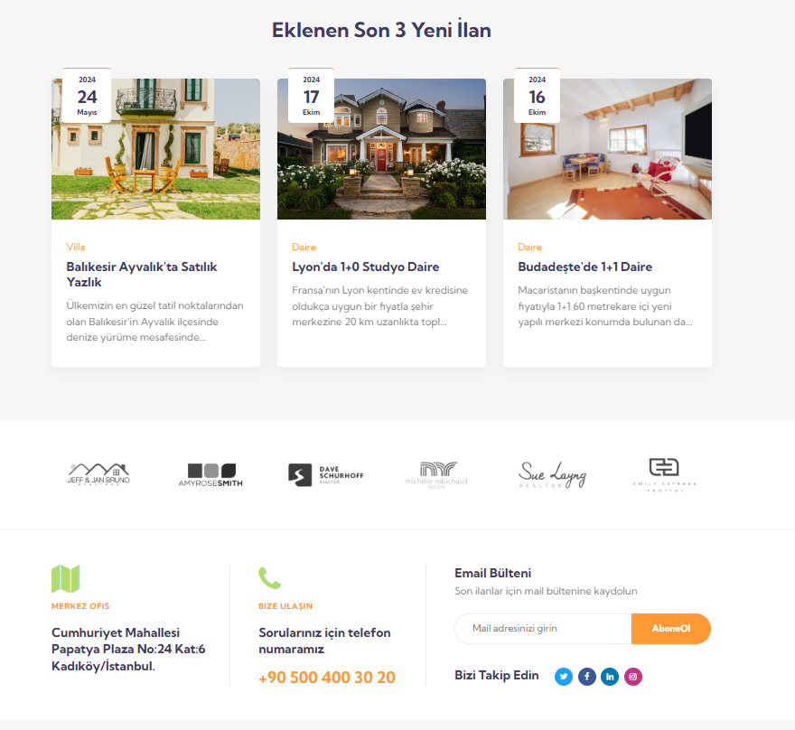
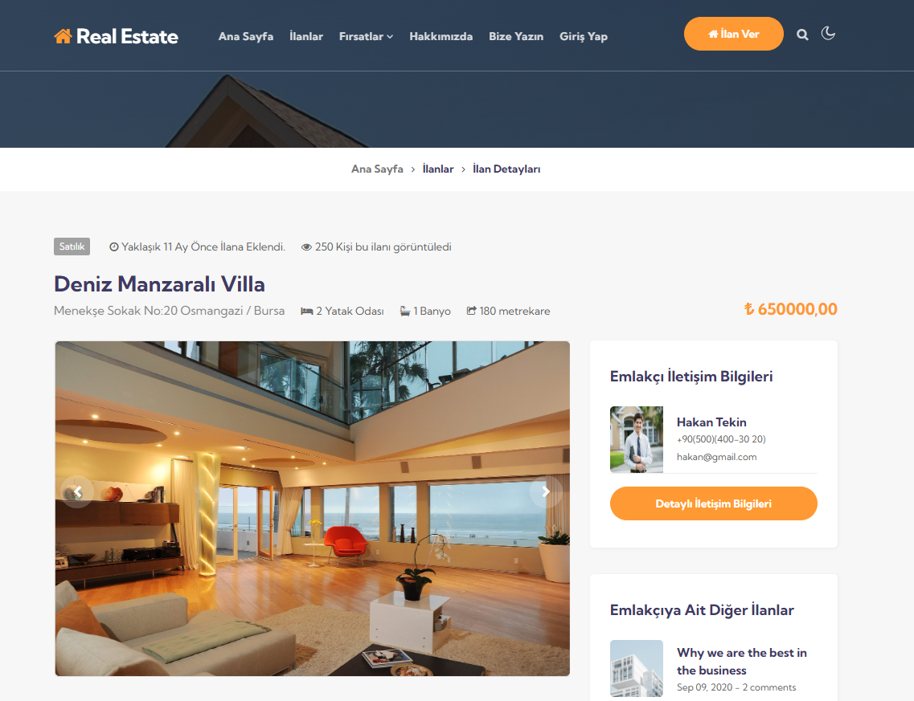
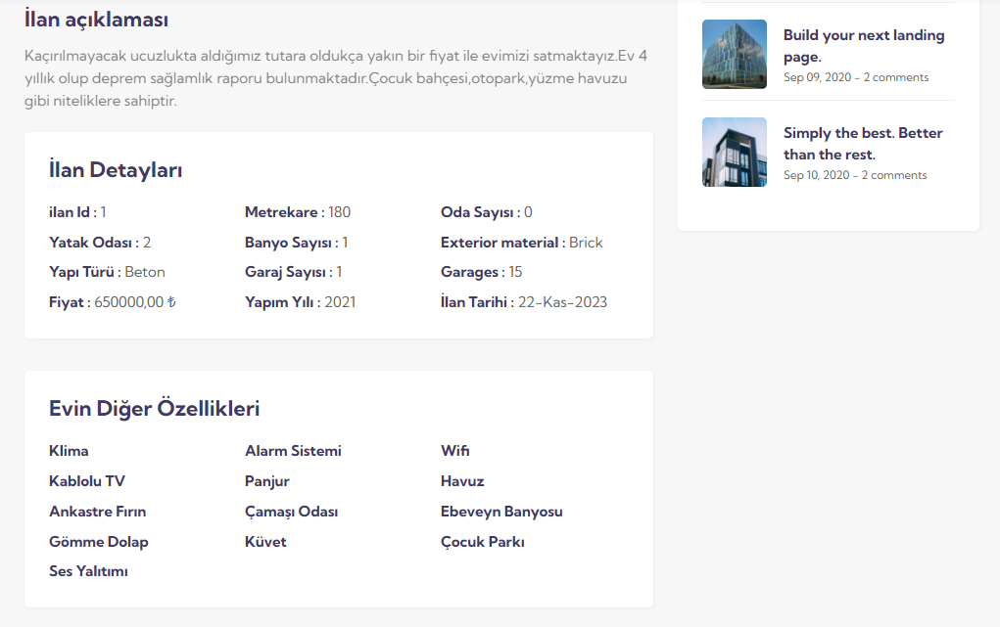
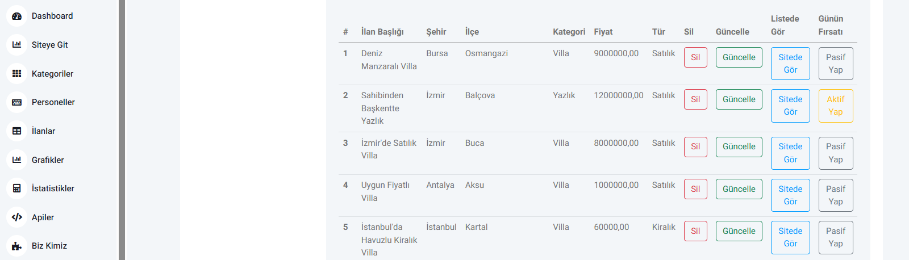
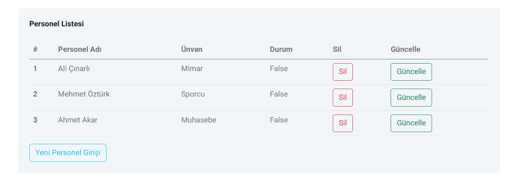
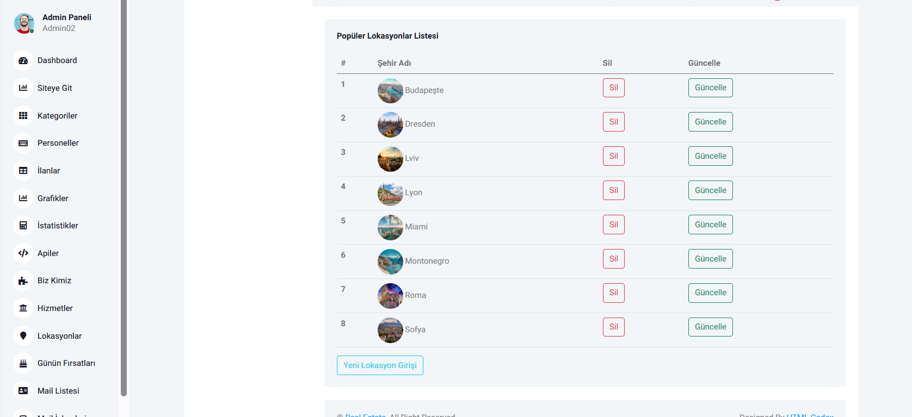
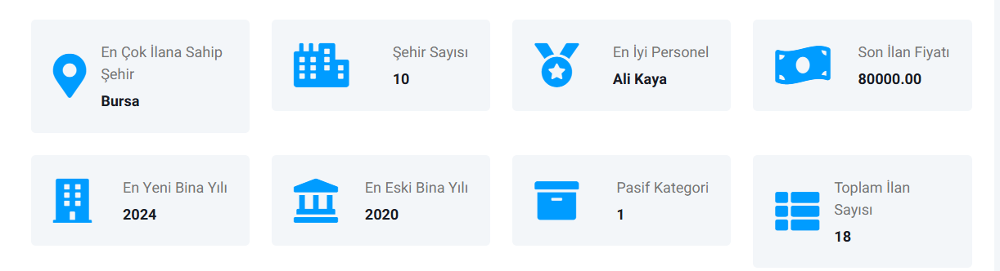

# Real Estate Management System

This project is an ASP.NET Core-based real estate management application developed to manage property listings, cities, and real estate agents. The application uses Dapper ORM for fast and efficient database operations and provides data management through a RESTful API. Swagger is used for API documentation and testing.

## Features

- 🚀 **Fast and Efficient Database Operations**: Powered by Dapper ORM on ASP.NET Core.
- 🌐 **RESTful API**: RESTful API is designed to organize and query data.
- 📋 **Swagger Integration**: Swagger is used to create and test API documentation.
- 📂 **Clean Folder Structure**: Organized in accordance with clean code principles.
- 🗃️ **Database Operations**: Contains related tables, sections, triggers and procedures.
- 🔐 **Secure Login**: Authentication is handled using JWT tokens to ensure user security
- 📈 **Admin Panel**: There is an admin panel where real estate-related statistics can be viewed.
- 🏠 **Real Estate Management System:**: Users can create and manage their own real estate.
- 🔍 **Advanced Search Feature**: Allows users to find what they are looking for by searching by category and city.
  

## Technologies & Languages ​​Used
## Backend Technologies
### Backend
- **ASP.NET Core 8.0**
- **Dapper ORM**
- **MSSQL**
- **Swagger**
- **SignalR**
- **JWT (Json Web Token)**

## Frontend
- **CSS**
- **Bootstrap**
- **JavaScript**
  

  
## Site Images
  
  
  
  
  
## Detail Page Images  
  
  
## Admin Panel Images
  
  
  
  
  
